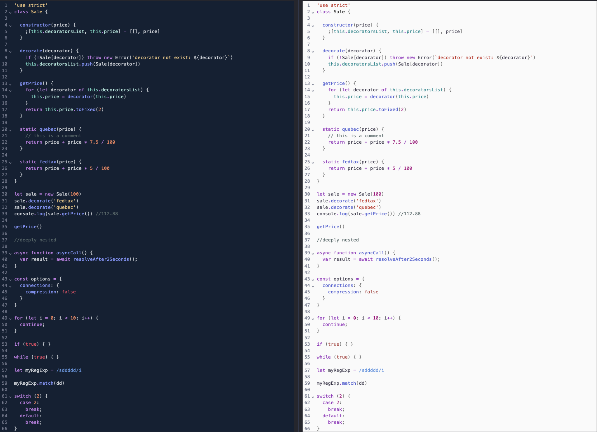

# code-mirror-night-owl

Night Owl Theme for CodeMirror 6, based on the [Night Owl](https://github.com/sdras/night-owl-vscode-theme) VS Code theme.



## Install

```bash
npm install code-mirror-night-owl
```

## Usage

#### Basic setup

```javascript
import { EditorState } from "@codemirror/state";
import { EditorView } from "@codemirror/view";
import { javascript } from "@codemirror/lang-javascript";
import { nightOwl } from "code-mirror-night-owl/night-owl";

const state = EditorState.create({
  doc: "my source code",
  extensions: [javascript(), nightOwl],
});

const view = new EditorView({
  parent: document.querySelector("#editor"),
  state,
});
```

#### Light theme

```javascript
import { EditorState } from "@codemirror/state";
import { EditorView } from "@codemirror/view";
import { javascript } from "@codemirror/lang-javascript";
import { nightOwlLight } from "code-mirror-night-owl/night-owl-light";

const state = EditorState.create({
  doc: "my source code",
  extensions: [javascript(), nightOwl],
});

const view = new EditorView({
  parent: document.querySelector("#editor"),
  state,
});
```

## API Reference

<dl>
<dt id="u-night-owl">
   <code><strong><a href="#u-night-owl">nightOwl, nightOwlLight</a></strong> : <a href="https://codemirror.net/docs/ref#state.Extension">Extension</a></code>
</dt>
<dd>
    <p>Extension to enable the Night Owl and Night Owl Light theme (both the editor theme and the highlight style).</p>
</dd>

<dt id="u-night-owl-theme">
    <code><strong><a href="#u-night-owl-theme"> nightOwlTheme, nightOwlLightTheme </a></strong>: <a href="https://codemirror.net/docs/ref#state.Extension">Extension</a></code>
</dt>
<dd>
    <p>The editor theme styles for Night Owl.</p>
</dd>

<dt id="night-owl-highlight-style">
    <code><strong><a href="#night-owl-highlight-style"> nightOwlHighlightStyle , nightOwlLightHighlightStyle</a></strong>: <a href="https://codemirror.net/docs/ref#language.HighlightStyle">HighlightStyle</a></code>
</dt>
<dd>
    <p>The highlighting style for code in the Night Owl theme.</p>
</dd>

<dt id="night-owl-colors">
    <code><strong><a href="#night-owl-colors"> colors </a></strong>: <a href="#night-owl-colors">Javascript Object</a></code>
</dt>
<dd>
 <p>The colors used in the theme, as CSS color strings.</p>
</dd>

</dl>
